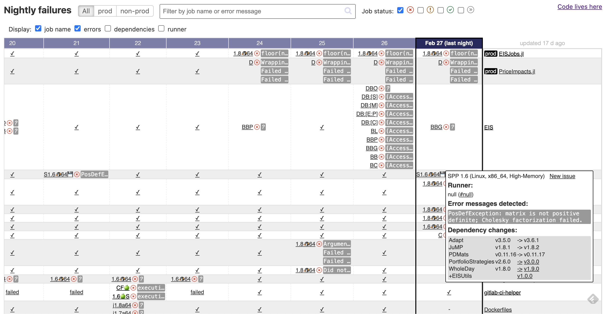

# GitLab dashboard

A dashboard that I designed and built while I was at [Invenia](https://github.com/invenia), to track Continuous Integration failures across 100+ GitLab repositories.
This made it easier to catalog issues and recognize patterns over time, reducing the maintenance load incurred by the dev team.

It's ownership was transferred to me when I left the company. Note this repo is not very polished and is untested. It's not actively maintained.

### Screenshot



The idea is to have a top-level view of nightly failures across all repos (rows) and across time (columns), in order to help manage and investigate issues that come up during nightly CI runs.
Hovering a job link gives the full error message detected in the logs, and additional info such as the list of dependency changes.

### How can the dashboard help?

Nightly role:
- which package pipelines have failed last night?
- do the packages fail in a similar way?
- were they failing in a similar way before?

Issue triage:
- which issues are the most prevalent?
- how often does issue X show up? Any pattern of note, e.g. relative to other failures?
- what Julia dependency changed compared to the previous run?
- create a GitLab issue in one click

### Ideas to make it more useful
- list most prevalent errors, highlight errors not seen before
- indicate run time e.g. using color, to help detect slowdowns across repos

## Setup

The dashboard is served by [Gitlab Pages](https://docs.gitlab.com/ee/user/project/pages/) and can be found [here](https://invenia.pages.invenia.ca/continuous-delivery/gitlab-dashboard/).

It is built daily by a [CI pipeline for the current repo](https://gitlab.invenia.ca/invenia/gitlab-dashboard/-/pipelines) (schedule currently setup under `@arnaud.henry`'s account at `0 0 * * *` with timezone `Central Time (US & Canada)`).

The static content is made up of HTML, Javascript, CSS, and JSON.

The JSON files contain all the projects and pipeline data that the dashboard visualises.
They are generated by the [download_pipelines_info.sh](./download_pipelines_info.sh) and [find_patterns_in_logs.py](./find_patterns_in_logs.py) scripts.

The [download_pipelines_info.sh](./download_pipelines_info.sh) script uses a GitLab API access token in order to download projects and pipeline data, and also to clone the eis repo.
How the token is generated:
1. log into Gitlab (current token was generated by Arnaud Henry)
2. go to https://gitlab.invenia.ca/-/profile/personal_access_tokens
3. generate token with `read_api` and `read_repository` scope

When the script is run as part of the gitlab-dashboard CI pipeline, it reads the `GITLAB_ACCESS_TOKEN` masked variable found in the [CI settings](https://gitlab.invenia.ca/invenia/gitlab-dashboard/-/settings/ci_cd).

## Run locally

1. Generate a Gitlab [Personal Access Token](https://gitlab.invenia.ca/-/profile/personal_access_tokens), selecting the `read_api` scope

2. Export it in your terminal

```
export GITLAB_ACCESS_TOKEN=<token>
```

3. Download data from GitLab API

```
./download_pipelines_info.sh
```

This will store files under `responses/`, and will also generate `public/combined_small.json` which combines all the useful data into one file.

4. Find error patterns in logs

```
./find_patterns_in_logs.py
```

5. Start a webserver to serve the `public/` directory

```
python3 -m http.server --directory public
```

6. Go to [http://localhost:8000/](http://localhost:8000/)

Once running, you can make changes to any of the static files (js, html, css, json), and simply reload the page to see the changes.

## Notes 

#### Useful GitLab API calls

[Projects](https://docs.gitlab.com/ee/api/projects.html)

- GET /projects
- GET /projects/:id

[Pipeline schedules](https://docs.gitlab.com/ee/api/pipeline_schedules.html)

- GET /projects/:id/pipeline_schedules

[Pipelines](https://docs.gitlab.com/ee/api/pipelines.html)

- GET /projects/:id/pipelines ?username
- GET /projects/:id/pipelines/:pipeline_id

[Jobs](https://docs.gitlab.com/ee/api/jobs.html)

- GET /projects/:id/pipelines/:pipeline_id/jobs
- GET /projects/:id/jobs
- GET /projects/:id/jobs/:job_id
- GET /projects/:id/jobs/:job_id/trace


**Q**: how many API calls are needed to get all the information we want?

```
R repos, P total failed pipelines per day, J total failed jobs per day, D days

5     GET /projects (5 due to pagination)
R     GET /projects/:id/pipelines (+ pagination if more than 100 days)
P*D   GET /projects/:id/pipelines/:pipeline_id/jobs
J*D   GET /projects/:id/jobs/:job_id/trace
=> total 5+R+(P+J)*D

Rough estimation:
  R=100 repos
  P=5 failed pipelines per day
  J=10 failed jobs per day
=> total 105 + 15 * D
  => 120 for 1 day
  => 555 for 30 days
```
In practice I had approximately 1,000 API calls for 30 days for all nightly-dev pipelines (in December). Took 10 min to run the download script.


[nightly]: https://gitlab.invenia.ca/invenia/wiki/-/blob/master/dev/nightly.md
